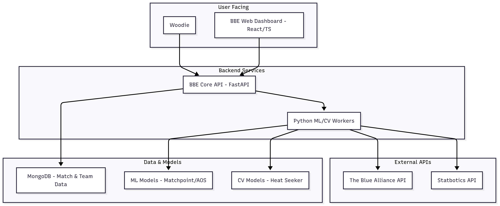

# Blue Banner Engine (BBE) 🔵

*An AI-driven scouting and strategy platform designed to provide FRC teams with a decisive competitive edge by transforming data into actionable intelligence.*

---

## Table of Contents

- [Project Vision](#project-vision)
- [Core Features & Modules](#core-features--modules)
  - [1. Matchpoint (MP) - The Predictive Oracle](#1-matchpoint-mp---the-predictive-oracle)
  - [2. OPL (Alliance Optimization System) - The Architect](#2-OPL-alliance-optimization-system---the-architect)
  - [3. The Playbook (PBK) - The Strategic Coach](#3-the-playbook-pbk---the-strategic-coach)
  - [4. Heat Seeker (HS) - The Field Cartographer](#4-heat-seeker-hs---the-field-cartographer)
  - [5. Woodie - The Conversational Agent](#5-woodie---the-conversational-agent)
- [System Architecture](#system-architecture)
- [Tech Stack](#tech-stack)
- [Getting Started](#getting-started)
  - [Prerequisites](#prerequisites)
  - [Installation](#installation)
- [Project Roadmap](#project-roadmap)
- [Contributing](#contributing)
- [License](#license)
- [Acknowledgments](#acknowledgments)

---

## Project Vision

In the competitive world of FIRST Robotics Competition, success is born from a blend of robust engineering and brilliant strategy. While most teams excel at the former, strategic decision-making often relies on intuition, incomplete data, and biased observations.

The **Blue Banner Engine (BBE)** aims to revolutionize FRC scouting by replacing guesswork with data science. Our mission is to build an open-source suite of intelligent tools that provide clear, actionable, and predictive insights. We empower teams to understand not just *what* happened, but *why* it happened and *what* is most likely to happen next, ultimately leading to more wins and more Blue Banners.

---

## Core Features & Modules

BBE is built on five interconnected pillars, each designed to solve a specific strategic challenge.

### 1. Matchpoint (MP) - The Oracle

- **What:** A machine learning model that predicts match outcomes, including the winning alliance and the final scores.
- **Why:** To provide an objective, data-driven forecast for upcoming matches, allowing teams to prioritize strategy, manage expectations, and make informed decisions on offensive vs. defensive playstyles.
- **How:** By training a Gradient Boosting model (XGBoost) on thousands of historical match data points from The Blue Alliance and Statbotics. It uses synergy-based features to understand alliance composition, not just individual team strength.

### 2. OPL (Optimal Pick-Lister) - The Architect

- **What:** A simulation-based system that generates an **Optimal Pick List (OPL)** for alliance selection.
- **Why:** Alliance selection is the single most impactful moment of a competition. OPL moves beyond simple rankings to identify which available teams offer the greatest *synergistic advantage*, maximizing the probability of winning the entire elimination tournament.
- **How:** It uses a Monte Carlo simulation to run thousands of hypothetical tournament brackets. For each potential alliance, it uses `Matchpoint` to predict performance against top opponents, calculates a "Synergy Score," and ranks picks based on their marginal contribution to winning a Blue Banner.

### 3. The Playbook (PBK) - The Coach

- **What:** An AI-powered engine that translates complex model data into simple, actionable pre-match strategic advice.
- **Why:** A prediction is useless without a plan. `The Playbook` bridges the gap between data and on-field execution, giving the drive team clear, concise priorities.
- **How:** It uses SHAP (SHapley Additive exPlanations) to understand *why* `Matchpoint` made its prediction. It then feeds these insights into a rule-based system (or an LLM) to generate a strategic brief with sections like "Our Key to Winning," "Primary Threat," and "Opportunity to Exploit."

### 4. Heat Seeker (HS) - The Cartographer

- **What:** A Computer Vision module that analyzes match videos to generate heatmaps and trajectory plots of robot movement.
- **Why:** API data doesn't capture spatial strategy. `Heat Seeker` reveals the parts of the field a team controls, their typical scoring paths, and their defensive positioning, offering a powerful layer of non-obvious strategic insight.
- **How:** It uses a YOLOv8 object detection model to identify and track robots in match footage. By aggregating positional data over time, it visualizes team behavior, revealing patterns that are invisible to the naked eye.

### 5. Woodie - The Omniscient

- **What:** A friendly conversational chatbot providing instant access to all FRC data and BBE insights.
- **Why:** To democratize data access for the entire team. A mentor in the stands, a mechanic in the pits, or a strategist at the whiteboard can get immediate answers without needing to navigate complex dashboards, making data accessible at the moment it's needed most.
- **How:** It integrates with the The Blue Alliance API for live data and our internal BBE APIs with MCP for predictions and strategies. Using modern NLP and RAG (Retrieval-Augmented Generation) techniques, it can answer natural language questions like, *"What's the prediction for our next match?"* or *"Show me the strengths of team 9280."*

---

## System Architecture

BBE is designed with a modern, decoupled architecture to ensure scalability and maintainability.

---

## Tech Stack

| Category              | Technology                                               |
| --------------------- | -------------------------------------------------------- |
| **Frontend**          | React, TypeScript, Vite, Tailwind CSS v4                 |
| **Backend & API**     | Python, FastAPI / Flask                                  |
| **Machine Learning**  | Scikit-learn, XGBoost, SHAP, Pandas, NumPy               |
| **Computer Vision**   | OpenCV, PyTorch, YOLO                                  |
| **Database**          | MongoDB                                                  |
| **Woodie**           |  RAG with LLMs                                |
| **DevOps**            | Docker, GitHub Actions                                   |

---

## License

This project is licensed under the MIT License - see the `LICENSE` file for details.

---

## Acknowledgments

-   **Pablo Armando Mac Beath Milián** 
-   **Rene Cumplido Feregrino** 